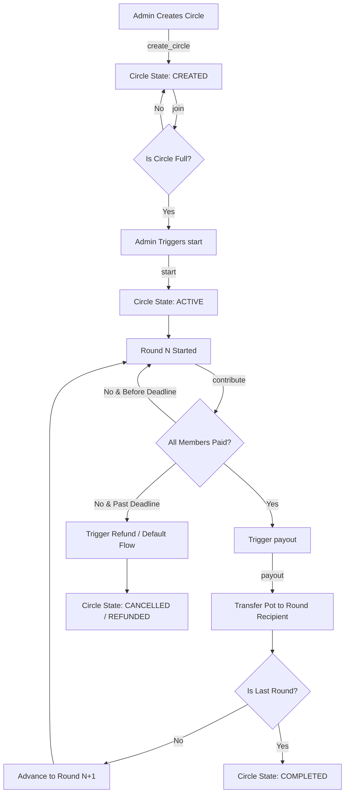

# System Architecture & Design Document (DESIGN.md) 📐

## 1. Executive Summary

**Ajo Protocol** is a decentralized Rotating Savings and Credit Association (ROSCA) protocol implemented on the **Stellar Blockchain** using **Soroban Smart Contracts**. 

The goal of Ajo is to provide a transparent, tamper-proof platform where social groups can pool funds periodically (in USDC or Stellar Asset Contracts) and systematically distribute the round pool ("the pot") to each participant according to a deterministic or randomized payout order.

---

## 2. Complete Protocol Workflow



### Protocol Execution Phases

#### Phase 1: Circle Initialization
1. **Circle Creator (Admin)** calls `create_circle`:
   - Defines target stablecoin asset (`token`: Address)
   - Contribution per member per round (`amount`: i128)
   - Round period duration in seconds (`period_secs`: u64)
   - Maximum allowable participants (`max_members`: u32)
2. Contract initializes `CircleState::Created` and assigns a unique incrementing `circle_id`.

#### Phase 2: Member Onboarding
1. Participants call `join(circle_id)` with their authenticated address (`member.require_auth()`).
2. The contract verifies:
   - Circle is in `Created` state.
   - Current member count < `max_members`.
   - Member has not already joined.
3. Member is added to `members` list.

#### Phase 3: Activation & Order Locking
1. Admin (or auto-trigger when full) calls `start(circle_id)`.
2. Contract locks membership:
   - State shifts from `Created` to `Active`.
   - Generates the payout order (sequential by join order or pseudo-random shuffle).
   - Sets the round start time (`current_round_start = env.ledger().timestamp()`).

#### Phase 4: Contribution & Escrow
1. In each round, members call `contribute(circle_id)`.
2. Contract verifies:
   - Circle is `Active`.
   - Member has not already contributed in the current round.
   - Current timestamp is within `current_round_start + period_secs`.
3. Contract executes Stellar Asset Contract `transfer_from(member, contract_address, amount)`.
4. Contract records contribution state for `(circle_id, round_id, member)`.

#### Phase 5: Payout & Round Progression
1. Once all members have contributed (or `payout` trigger conditions are met):
   - Contract calculates `total_pot = amount * member_count`.
   - Identifies `recipient = payout_order[current_round]`.
   - Contract executes Stellar Asset Contract `transfer(contract_address, recipient, total_pot)`.
   - Emits `PayoutEvent { circle_id, round_id, recipient, amount }`.
2. If `current_round < max_members - 1`:
   - Increments `current_round += 1`.
   - Resets round contribution tracking.
3. Else:
   - Marks circle as `Completed`.

---

## 3. Smart Contract Design Specifications (`ajo-contracts`)

### Data Structs (Soroban Rust)

```rust
pub enum CircleStatus {
    Created = 0,
    Active = 1,
    Completed = 2,
    Cancelled = 3,
}

pub struct Circle {
    pub id: u64,
    pub admin: Address,
    pub token: Address,
    pub amount: i128,
    pub period_secs: u64,
    pub max_members: u32,
    pub status: CircleStatus,
    pub current_round: u32,
    pub round_start_time: u64,
    pub members: Vec<Address>,
    pub payout_order: Vec<Address>,
}

pub struct RoundState {
    pub circle_id: u64,
    pub round_id: u32,
    pub total_collected: i128,
    pub paid_members: Vec<Address>,
    pub is_settled: bool,
}
```

### Storage Management & TTL Extension Strategy
Soroban entries use `env.storage().persistent()`. Because storage entries can expire if unused, every state read/write must invoke TTL extensions:

```rust
// Extend Circle storage entry live until ledger_seq + 500,000 (~1 month)
env.storage().persistent().extend_ttl(&key, 100_000, 500_000);
```

---

## 4. Threat Model & Trust Assumptions

### 🛡 Threat Matrix

| Threat / Attack Vector | Severity | Mitigation Strategy in v1 | Future Enhancements |
| :--- | :--- | :--- | :--- |
| **Free-Rider Default** (Member receives pot in Round 1 and quits) | **CRITICAL** | Clear UI risk disclosure; round deadline with refund rules | Collateral deposits, social vouching, on-chain credit scores |
| **Admin Abuse** (Admin tries to steal pooled funds) | **HIGH** | Contract holds funds in escrow; contract logic prevents admin withdrawals without explicit member payout conditions | Multisig governance, timelocks |
| **Token Freeze / Clawback** (Stablecoin issuer revokes USDC) | **MEDIUM** | Strict usage of Stellar Asset Contract standards; documented trust assumptions | Multi-asset allowlist, decentralized stablecoin support |
| **Soroban Storage Expiry** (Data drops off-chain due to TTL expiry) | **HIGH** | Auto-extending TTL on every `contribute()` and `payout()` invocation | Keeper bot network for persistent TTL maintenance |
| **Front-Running / MEV** | **LOW** | Fixed payout schedule deterministic upon `start()` call | VRF (Verifiable Random Function) order generation |

### 🔒 Trust Assumptions
1. **Members trust each other off-chain** (v1 assumption for ROSCAs).
2. **Users trust the Stellar Asset Contract issuer** (e.g., Circle for USDC).
3. **Users trust the compiled Soroban WASM byte-code** deployed on Stellar Testnet/Mainnet.

---

## 5. Architectural Design Decisions

1. **Stablecoin Only (USDC via SAC)**: Native XLM price volatility destabilizes fixed ROSCA round targets. USDC provides predictable fiat-pegged contributions.
2. **Immutable Contract vs Upgradeability**: v1 contracts are deployed immutable to ensure admin cannot tamper with escrow logic post-deployment.
3. **Deadline & Refund Flow**: If a member misses a contribution deadline, the contract allows existing contributors of that round to claim a full refund, transitioning the circle to `Cancelled`.
