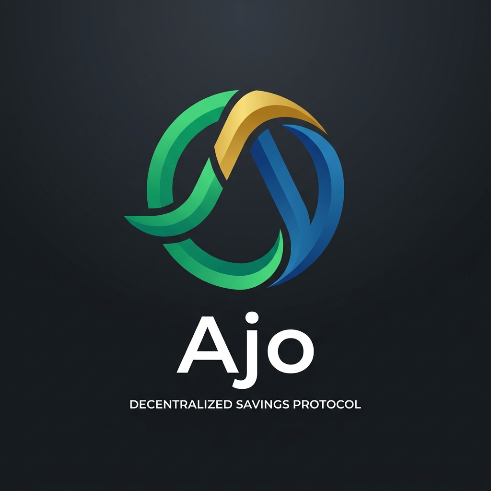
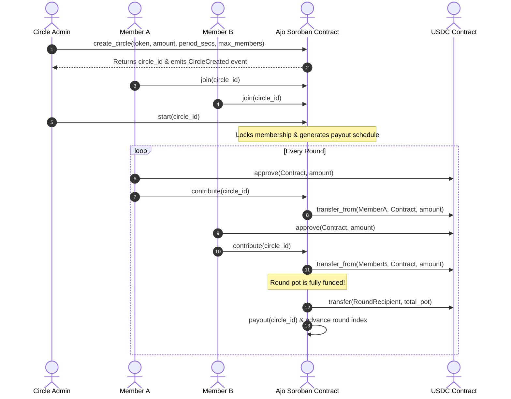

# Ajo Protocol 🔄🏦

> **Decentralized Rotating Savings & Credit Association (ROSCA) on Stellar & Soroban**



[](https://soroban.stellar.org/)
[](https://stellar.org/)
[](https://nextjs.org/)
[](LICENSE)

---

## 🌟 Overview

**Ajo Protocol** brings the time-tested African tradition of **Ajo / Esusu / Chama** (Rotating Savings and Credit Associations - ROSCAs) onto the **Stellar blockchain** using **Soroban smart contracts**. 

In traditional ROSCAs, a group of trusted individuals contributes a fixed amount of money periodically (weekly/monthly), and in each round, one member takes home the entire collected pool ("the pot"). **Ajo Protocol** automates payment collection, turn distribution, and escrow settlement using smart contracts and stablecoins (USDC), eliminating middleman bias, manual tracking errors, and geographical boundaries.

---

## 🏗 Repository Structure

This workspace is organized into a dual-repository architecture designed for maintainers and open-source contributors:

```
ajo/
├── assets/
│   └── logo.jpg               # Project branding assets
├── ajo-contracts/             # Soroban Smart Contracts (Rust)
│   ├── README.md              # Contract setup & compilation guide
│   ├── DESIGN.md              # Soroban storage, functions & error specs
│   └── AGENDA.md              # Contract issues & audit roadmap
├── ajo-app/                   # Next.js Web App & Frontend (TypeScript)
│   ├── README.md              # Web app setup & development guide
│   ├── DESIGN.md              # UI/UX architecture & wallet integration
│   └── AGENDA.md              # App issues & client roadmap
├── DESIGN.md                  # Master System Architecture & Threat Model
├── AGENDA.md                  # Master Roadmap & Contributor Starter Issues
└── README.md                  # Project master documentation (This file)
```

---

## 🔄 End-to-End System Flow



---

## 🚀 Quick Start & Local Setup

### 1. Prerequisites
- **Rust** `v1.75+` & `wasm32-unknown-unknown` target
- **Soroban CLI** (`cargo install --locked soroban-cli`)
- **Node.js** `v18+` & `pnpm` / `npm`
- **Freighter Wallet** browser extension

### 2. Smart Contract Setup (`ajo-contracts`)
```bash
cd ajo-contracts
# Build contract WASM
cargo build --target wasm32-unknown-unknown --release

# Run Rust unit tests
cargo test

# Deploy to Stellar Testnet (using Soroban CLI)
soroban contract deploy \
  --wasm target/wasm32-unknown-unknown/release/ajo_contracts.wasm \
  --source admin \
  --network testnet
```

### 3. Web Application Setup (`ajo-app`)
```bash
cd ajo-app
# Install dependencies
npm install

# Generate TypeScript contract bindings
soroban contract bindings typescript \
  --wasm ../ajo-contracts/target/wasm32-unknown-unknown/release/ajo_contracts.wasm \
  --output-dir ./src/contracts/ajo

# Start development server
npm run dev
```

---

## 🛡 Risk Disclosures & Security Positioning

> [!WARNING]
> **EXPERIMENTAL SOFTWARE FOR TESTNET USE ONLY.**  
> Ajo Protocol is an open-source, unaudited smart contract system. It automates ROSCA escrow mechanics but **does not remove credit or counterparty default risk**. 

1. **No Trustless Default Elimination**: If a member receives the pot in Round 1 and fails to contribute in Round 2, the smart contract cannot magically extract funds from their external wallet without collateral/deposits.
2. **Stablecoin Dependency**: Ajo uses USDC (Stellar Asset Contract). Issuers retain the ability to freeze or claw back assets according to regulatory policies.
3. **Soroban State TTL**: Soroban persistent storage relies on Time-To-Live (TTL) extensions. Circles must periodically extend their state TTL to prevent data expiration on-chain.

For a detailed risk analysis, view [DESIGN.md](file:///Users/user/ajo/DESIGN.md).

---

## 🗺 Contributor Roadmap & Issues

We welcome open-source maintainers and contributors! Check our [AGENDA.md](file:///Users/user/ajo/AGENDA.md) for the full breakdown of **17 starter issues** across Rust contracts, Next.js frontend, and DevOps pipelines.

---

## 📜 License
Licensed under the [MIT License](LICENSE).
