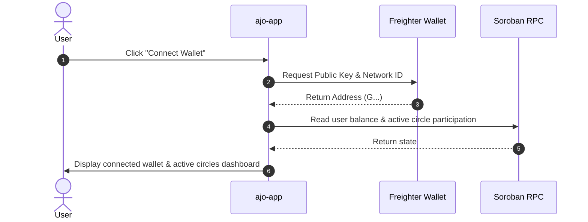

# Frontend UX & System Architecture Design (ajo-app/DESIGN.md) 🎨📱

## 1. Overview

The `ajo-app` frontend interfaces users with Ajo Soroban contracts. It emphasizes mobile responsiveness (since over 85% of African Web3 users access via mobile devices), real-time round progress indicators, and local currency contextualization (NGN display).

---

## 2. Component Hierarchy & Wireframe Flow

```
Root Layout (WalletProvider, RiskBanner)
 ├── Navbar (Logo, Network Badge, WalletConnect)
 ├── Main Content
 │    ├── Landing Page (Hero, How Ajo Works, Active Circles List)
 │    ├── Create Circle Wizard (/create)
 │    │    ├── Step 1: Savings Goal & Token Choice
 │    │    ├── Step 2: Member Limits & Duration Setup
 │    │    └── Step 3: Review & Deploy Transaction
 │    └── Circle Dashboard (/circle/[id])
 │         ├── Circle Header (Title, Admin, Token, Status Badge)
 │         ├── Round Progress (Collected vs Target Pot, Progress Bar)
 │         ├── Member Status Grid (Paid, Pending, Recipient)
 │         └── Action Panel (Contribute Button, Payout Button, Refund Button)
 └── Footer (Risk Disclosure, Github, Stellar Explorer Links)
```

---

## 3. Wallet Integration Lifecycle (`Stellar Wallets Kit`)



---

## 4. Key User Workflows

### 1. Contributing to a Circle
1. User clicks **"Contribute [X] USDC"**.
2. App checks user's token allowance for `AJO_CONTRACT_ADDRESS`.
3. If allowance < contribution amount:
   - Prompt user to sign a Stellar Asset Contract `approve()` transaction.
4. App submits Soroban `contribute(circle_id, user_address)` invocation via Freighter.
5. App polls RPC for transaction status until confirmed.
6. UI triggers confetti and updates round contribution indicator.

### 2. Local Currency Display (USD -> NGN)
- App maintains an async hook `useExchangeRate()` fetching USD/NGN rates from a resilient ticker API.
- All amounts (e.g. `50 USDC`) display an estimated equivalent tag (e.g. `~ ₦75,000 NGN`).

---

## 5. Security & Risk UX Standards

1. **Testnet Warning Banner**: Displayed persistently across all pages.
2. **Transaction Simulation**: Every write transaction simulates via RPC before prompting wallet signature, preventing wasted gas or failed tx errors.
3. **Transparent Risk Disclosures**: Prominently display counterparty default warnings on circle creation and detail pages.
